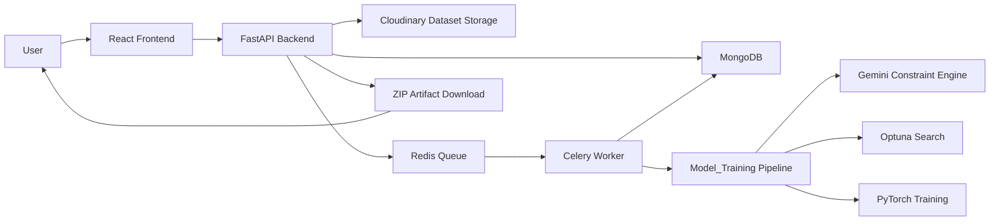
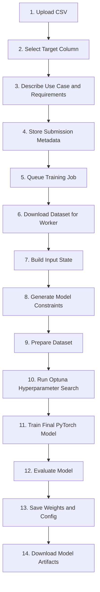

# Data2model

Data2model is an end-to-end machine learning platform that converts a raw CSV dataset into a trained, downloadable neural network model. Users upload data, define the prediction target, describe the business use case in natural language, and the system handles the rest: data preparation, model constraint generation, hyperparameter search, training, artifact storage, and model download.

The project combines a React dashboard, a FastAPI backend, MongoDB persistence, Cloudinary dataset storage, Redis/Celery background training, and a PyTorch-based AutoML pipeline powered by Optuna and Gemini-assisted constraint generation.

## Key Features

- **Dataset-to-model workflow**: Upload a CSV file and receive trained model artifacts without manually writing training code.
- **Natural language requirements**: Provide use-case details and training preferences that are converted into model constraints.
- **Automated preprocessing**: Cleans, encodes, scales, and splits datasets for training and evaluation.
- **Neural network optimization**: Uses Optuna to search model architecture and hyperparameters for PyTorch MLP models.
- **Asynchronous training**: Runs long training jobs through Celery workers so the API and UI remain responsive.
- **Authenticated artifact downloads**: Stores trained weights and model configuration, then packages them as a ZIP for secure download.
- **Prediction endpoint**: Allows completed models to run inference on compatible test CSV files.

## System Architecture



## How Data Becomes a Model



### Workflow Explanation

1. **User submits a dataset**
   The React frontend collects the CSV file, target column, use case, and model requirements. The request is sent to the FastAPI backend using JWT authentication.

2. **Backend stores the job**
   FastAPI uploads the dataset to Cloudinary and stores submission metadata in MongoDB, including user ownership, target column, status, logs, and artifact fields.

3. **Training is queued**
   When the user starts training, the backend creates a Celery task and marks the submission as queued. Redis acts as the broker between the API and the worker.

4. **Worker runs the ML pipeline**
   The Celery worker downloads the dataset and executes the `Model_Training` pipeline. Gemini helps translate natural language requirements into structured constraints, while preprocessing prepares the dataset for model training.

5. **Optuna searches for the best model**
   Optuna explores architecture choices and hyperparameters such as layer sizes, activation functions, optimizer settings, learning rate, dropout, and regularization.

6. **PyTorch trains the final network**
   The best configuration is used to train a final neural network. The system evaluates the model and generates production-ready artifacts.

7. **Artifacts are stored and downloaded**
   The trained `.pth` weights and JSON model configuration are saved back to MongoDB. The authenticated download endpoint packages them into a ZIP file for the user.

## Repository Structure

```text
Data2model/
|-- app/                    # FastAPI backend, auth, routes, services, Celery task wiring
|-- react-frontend/         # React + Vite dashboard for submissions, training, logs, downloads
|-- frontend/               # Streamlit interface retained as an alternate client
|-- Model_Training/         # Core AutoML pipeline, preprocessing, Optuna, PyTorch training
|-- data-cleaner-api/       # Dataset cleaning service
|-- docs/                   # Operational notes and distributed training runbook
`-- README.md
```

## Technology Stack

| Layer | Technologies |
| --- | --- |
| Frontend | React, Vite, Lucide React |
| Backend API | FastAPI, Uvicorn, Pydantic |
| Authentication | JWT, Passlib, Bcrypt |
| Database | MongoDB, Motor, PyMongo |
| File Storage | Cloudinary |
| Background Jobs | Celery, Redis, Kombu |
| ML Pipeline | PyTorch, Scikit-learn, Pandas, NumPy |
| Optimization | Optuna |
| AI Constraint Engine | Google Gemini |

## API Capabilities

| Endpoint Area | Purpose |
| --- | --- |
| `/auth/register` | Create a user account |
| `/auth/login` and `/auth/login/json` | Authenticate and receive a JWT access token |
| `/auth/me` | Fetch the current authenticated user |
| `/submit/` | Create and list dataset submissions |
| `/submit/{id}/train` | Queue a training job |
| `/submit/{id}/logs` | Read training progress logs |
| `/submit/{id}/download` | Download trained model weights and config as a ZIP |
| `/submit/{id}/predict` | Run inference using a completed model |

## Getting Started

### Prerequisites

- Python 3.9+
- Node.js and npm
- MongoDB Atlas or local MongoDB
- Redis
- Cloudinary account
- Gemini API key

### Environment Variables

Create a `.env` file in the project root:

```env
PROJECT_NAME=Data2model
MONGODB_URL=mongodb://localhost:27017
DATABASE_NAME=data2model
SECRET_KEY=replace-with-a-secure-secret
ALGORITHM=HS256
ACCESS_TOKEN_EXPIRE_MINUTES=60

CLOUDINARY_CLOUD_NAME=your-cloud-name
CLOUDINARY_API_KEY=your-api-key
CLOUDINARY_API_SECRET=your-api-secret

GEMINI_API_KEY=your-gemini-api-key

REDIS_URL=redis://localhost:6379/0
CELERY_BROKER_URL=redis://localhost:6379/0
CELERY_RESULT_BACKEND=redis://localhost:6379/1
```

### Install Backend Dependencies

```powershell
python -m venv .venv
.\.venv\Scripts\activate
python -m pip install -r app\requirements.txt
python -m pip install -r Model_Training\requirements.txt
```

### Start Redis

```powershell
redis-server
```

On Windows, Redis can also be started through Docker, WSL, Memurai, or a hosted Redis service. Update the Redis environment variables if you are not using the local default.

### Start the FastAPI Backend

```powershell
.\.venv\Scripts\activate
python -m uvicorn app.main:app --host 127.0.0.1 --port 8000
```

The API will be available at:

```text
http://127.0.0.1:8000
```

### Start the Celery Worker

Use `--pool=solo` on Windows:

```powershell
.\.venv\Scripts\activate
python -m celery -A app.celery_app:celery_app worker --loglevel=info --pool=solo
```

### Start the React Frontend

```powershell
cd react-frontend
npm install
npm run dev
```

The frontend will be available at:

```text
http://127.0.0.1:5173
```

## Typical Usage

1. Register or log in from the React frontend.
2. Upload a CSV dataset.
3. Enter the target column.
4. Describe the use case and model requirements.
5. Submit the job.
6. Click **Train** to queue the Celery training task.
7. Monitor logs from the dashboard.
8. Download the ZIP artifact when training reaches `completed`.
9. Upload compatible test data to run predictions against the trained model.

## Model Artifacts

Each completed training job produces:

- `*_best_model.pth`: PyTorch model weights.
- `*_model_config.json`: Model architecture, preprocessing metadata, target details, and configuration required for inference.
- ZIP package: A downloadable bundle containing both artifacts.

The download route is protected by JWT authentication. In the React frontend, the app downloads artifacts through an authenticated API request and then creates a browser download from the returned ZIP blob.

## Direct CLI Training

The AutoML engine can also be run directly without the API or frontend:

```powershell
cd Model_Training
python main.py --csv_path "data.csv" --target "Price" --use_case "Predict house prices" --req "Optimize for low MAE and avoid overfitting"
```

## Operational Notes

- Keep FastAPI, Redis, the Celery worker, and the React frontend running in separate terminals during development.
- Training jobs require Redis and an active Celery worker.
- MongoDB stores users, submissions, logs, model weights, and model configuration.
- Cloudinary stores uploaded datasets so workers can retrieve them reliably.
- For more details on local distributed training, see `docs/distributed-training-runbook.md`.

## Project Status

Data2model is a full-stack ML automation project focused on turning structured datasets into trained neural network artifacts through an authenticated web workflow. It is suitable for experimentation, demonstrations, and further extension into a production-grade AutoML/MLOps platform.
